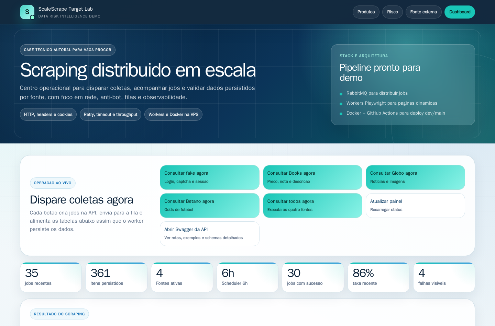

# ScaleScrape Lab

## Case Para Desenvolvedor Back-End Pleno

Este repositorio foi criado especificamente como case pratico para a vaga de
Desenvolvedor Back-End Pleno da Procob. A ideia e mostrar, com codigo rodando,
aderencia direta aos pontos da oportunidade: scraping em escala, sistemas
distribuidos, mensageria, processamento de alto volume, observabilidade,
debug de rede e operacao em Linux/Docker. Este projeto nao representa parceria
oficial com a Procob.

O projeto mostra, em um ambiente controlado, um pipeline completo com FastAPI,
RabbitMQ, Celery workers, Playwright, PostgreSQL, Alembic, Prometheus, Grafana,
Next.js e deploy automatizado em VPS. A documentacao executiva e tecnica do
case esta em [docs/case-procob-backend-pleno.md](docs/case-procob-backend-pleno.md).



Ambientes publicos de demonstracao:

- Dev UI: https://dev.scalescrape.cledson.com.br
- Dev dashboard: https://dev.scalescrape.cledson.com.br/dashboard
- Dev API docs: https://api-dev.scalescrape.cledson.com.br/docs
- Dev Grafana: https://grafana-dev.scalescrape.cledson.com.br
- Dev RabbitMQ: https://rabbit-dev.scalescrape.cledson.com.br
- Producao UI: https://scalescrape.cledson.com.br
- Producao dashboard: https://scalescrape.cledson.com.br/dashboard
- Producao API docs: https://api.scalescrape.cledson.com.br/docs
- Producao Grafana: https://grafana.scalescrape.cledson.com.br
- Producao RabbitMQ: https://rabbit.scalescrape.cledson.com.br

Credenciais operacionais nao ficam no repositorio. Grafana usa o usuario
`admin`; RabbitMQ Management usa `scalescrape_viewer`. As senhas ficam nos
secrets dos ambientes de deploy.

Fontes demonstradas no dashboard:

- `fake-target`: site proprio protegido por login, sessao, cookies, CAPTCHA de
  laboratorio e simulador anti-bot.
- `books-to-scrape`: catalogo publico usado para extrair titulo, preco original,
  preco convertido para real, nota e descricao.
- `globo-home`: home publica da Globo, com coleta de noticias por categoria,
  resumo, link e imagem salva localmente.
- `betano-football`: site de apostas esportivas, usado como fonte mais dificil
  para demonstrar diagnostico de bloqueios, browser profile, sessao, proxy
  proprio/Tailscale, fallback visual/API e persistencia de odds de futebol.

Laboratorio controlado de scraping em escala com Python, RabbitMQ, Playwright,
PostgreSQL, Prometheus, Grafana, target-site em Next.js/TypeScript, anti-bot
simulator, proxy rotation local, login protegido e CAPTCHA configuravel para
ambiente de laboratorio.

O objetivo e mostrar arquitetura de scraping em producao: filas, workers,
controle de concorrencia, retry/backoff, DLQ, circuit breaker, politicas de
seguranca, metricas e observabilidade. Tudo roda contra um target-site local do
proprio projeto.

Os itens extraidos sao persistidos no PostgreSQL em `scraped_items` por lote
idempotente de `job_id`, com `created_at` e `extracted_at` representando a
data/hora da extracao. Imagens
coletadas no scraper da Globo ficam em um volume Docker compartilhado e sao
servidas pela API em `/media`.

Para uma explicacao detalhada do fluxo do job, veja
[docs/fluxo-scraping.md](docs/fluxo-scraping.md).

## Arquitetura

```text
Usuario / Swagger
        ↓
FastAPI API
        ↓
PostgreSQL + job_events
        ↓
RabbitMQ
        ↓
Celery Workers
        ↓
Celery Beat Scheduler (a cada 6h)
        ↓
Playwright headless
        ↓
Proxy Manager
        ↓
Target Site Fake
        ↓
Login protegido
        ↓
CAPTCHA de laboratorio
        ↓
Anti-Bot Simulator
```

## Stack

- Python + FastAPI para API de orquestracao
- Next.js 16 + TypeScript para target-site fake visual
- Celery + RabbitMQ para filas
- Celery Beat para agendamento periodico a cada 6 horas
- Playwright Python para scraping
- PostgreSQL com SQLAlchemy e Alembic
- Prometheus + Grafana para monitoramento
- Provider de CAPTCHA plugavel, com mock local por padrao
- Docker Compose para infraestrutura local
- `unittest` para policies do worker
- Node test runner + TypeScript para dataset, anti-bot e componentes do target-site

## Como Rodar

```bash
cp .env.example .env
docker compose up --build
```

Servicos:

- API: http://localhost:8000/docs
- Target-site visual: http://localhost:4000
- RabbitMQ UI: http://localhost:15672
- Prometheus: http://localhost:9090
- Grafana: http://localhost:3000

## Migrations Do Banco

A API usa Alembic para evoluir o schema do PostgreSQL. No Docker, o container
da API executa `alembic upgrade head` antes de iniciar o `uvicorn`; nos Actions,
a mesma migration roda na VPS antes do smoke final.

Comando manual opcional:

```bash
docker compose run --rm api alembic -c alembic.ini upgrade head
```

## Benchmark De Carga Controlado

O script `tools/load_demo.py` dispara jobs concorrentes contra a API e resume
throughput, status, retries, itens coletados e percentis de duracao. Por padrao
ele usa `fake-target`, uma fonte interna e estavel para demonstrar volume sem
depender de terceiros.

Exemplo local com RabbitMQ Management:

```bash
python tools/load_demo.py --api-url http://localhost:8000 --jobs 30 --concurrency 10 --rabbitmq-url http://localhost:15672
```

Exemplo rapido:

```bash
python tools/load_demo.py --api-url http://localhost:8000 --jobs 3 --concurrency 2 --timeout 180
```

## Target-Site Visual Em Next.js

O target-site e uma vitrine local do simulador em Next.js 16 com App Router. O
visual foi inspirado na linguagem de protecao ao credito, prevencao a fraudes,
onboarding e monitoramento continuo usada pela Procob, sem copiar assets
proprietarios.

O portal inteiro exige login fake antes de mostrar qualquer pagina de dados; sem
cookie `lab_auth=ok`, `/`, `/items`, `/external/items` e demais rotas
redirecionam para `/login`. O login valida usuario, senha e CAPTCHA no servidor.
Depois do login, a home (`/`) mostra os cenarios disponiveis e as paginas de
dados preservam os seletores usados pelo Playwright:

- `/items?page=1`: dataset local sintetico, paginado e estavel
- `/login?next=/protected/items?page=1`: login fake com CAPTCHA de laboratorio
- `/protected/items?page=1`: dataset sob login, anti-bot local, session, risco e challenge
- `/external/items?page=1`: massa dinamica via API real RandomUser, cache de 6h e fallback local
- `/rate-limited/items`: resposta `429` para testar retry e cooldown
- `/forbidden/items`: resposta `403` para testar bloqueio
- `/unstable/items?page=1`: paginas pares retornam `500`
- `/layout-changed/items`: pagina sem `.item-card` para testar quebra de seletor

A fonte externa usa dados fake normalizados e nao expoe e-mail, telefone ou
documento. Se a API externa estiver indisponivel, o simulador usa uma massa
local deterministica para manter a demo funcionando.

## Como Criar Um Job

No Swagger (`/docs`), execute `POST /jobs`:

```json
{
  "source": "fake-target",
  "start_url": "http://target-site:4000/protected/items?page=1",
  "mode": "browser",
  "max_pages": 3
}
```

Para o scraping externo seguro, use a fonte publica Books to Scrape na categoria
Science Fiction:

```json
{
  "source": "books-to-scrape",
  "start_url": "https://books.toscrape.com/catalogue/category/books/science-fiction_16/index.html",
  "mode": "browser",
  "max_pages": 1
}
```

Esse fluxo extrai titulo, preco original em GBP, preco convertido para BRL,
nota, link de detalhe e descricao do livro. A conversao usa a taxa configuravel
`GBP_TO_BRL_RATE`, que por padrao fica em `6.50` para manter a demo
deterministica.

Depois que o job terminar, veja os registros extraidos em:

```text
GET /items
GET /items/page?source=globo-home&page=1&page_size=10
GET /jobs/{job_id}/items
```

Cada item retorna `extracted_at` e tambem grava esse horario em `raw_data` para
facilitar a demonstracao do momento em que o dado foi coletado.

Para noticias publicas da Globo, use:

```json
{
  "source": "globo-home",
  "start_url": "https://www.globo.com/",
  "mode": "browser",
  "max_pages": 1
}
```

Esse fluxo le os cards publicos da home, agrupa por categoria visual, abre a
noticia para enriquecer titulo/resumo, baixa a imagem para o volume local e
salva `image_public_path` em `raw_data`.

Visualmente, a rota `/dashboard` do target-site mostra:

- tabela de jobs recentes;
- tabelas paginadas separadas para fake-target, Books to Scrape, Globo e Betano;
- `public_url` para o dominio publico da demo;
- thumbnails da Globo servidas pela API;
- botoes para consultar agora cada fonte ou todas juntas.

### Scrapers Reais Em Destaque

O scraper da Globo usa a home publica para demonstrar coleta de noticias em
uma fonte real: o worker identifica cards, classifica por categoria, abre a
pagina de detalhe, le metadados `og:title`, `og:description` e `og:image`,
baixa a imagem para o volume compartilhado e disponibiliza a thumbnail no
dashboard.

O scraper da Betano foi incluido por ser uma fonte mais dificil: e um site de
apostas esportivas com frontend dinamico, modais, sessao, conteudo sensivel a
rede/localizacao e protecoes fortes contra automacao. O worker usa Playwright,
browser profile, sessao persistida, tentativa por API observada, fallback
visual/DOM, proxy proprio via Tailscale e artefatos de debug. Quando a fonte
libera acesso no ambiente autorizado, o sistema persiste campeonato, jogo,
data/hora, mercado e odds `1/X/2`; quando bloqueia, registra `403`, pagina
vazia ou mudanca de markup sem entrar em loop agressivo.

Em dev, acesse:

```text
https://dev.scalescrape.cledson.com.br/dashboard
```

## Agendamento A Cada 6 Horas

O projeto inclui um servico `scheduler` com Celery Beat. Ele funciona como um
cron job e dispara automaticamente, a cada 6 horas, quatro scrapings de demo:

- `fake-target`: `http://target-site:4000/protected/items?page=1`
- `books-to-scrape`: `https://books.toscrape.com/catalogue/category/books/science-fiction_16/index.html`
- `globo-home`: `https://www.globo.com/`
- `betano-football`: `https://www.betano.bet.br/sport/futebol/`

Configuracao:

```env
PUBLIC_TARGET_SITE_URL=https://dev.scalescrape.cledson.com.br
PUBLIC_API_URL=https://api-dev.scalescrape.cledson.com.br
SCALESCRAPE_API_URL=http://api:8000
MEDIA_ROOT=/app/media
ENABLE_SCHEDULED_SCRAPING=true
SCHEDULED_SCRAPE_INTERVAL_SECONDS=21600
SCHEDULED_PROTECTED_TARGET_URL=http://target-site:4000/protected/items?page=1
SCHEDULED_BOOKS_TO_SCRAPE_URL=https://books.toscrape.com/catalogue/category/books/science-fiction_16/index.html
SCHEDULED_GLOBO_HOME_URL=https://www.globo.com/
SCHEDULED_BETANO_FOOTBALL_URL=https://www.betano.bet.br/sport/futebol/
GLOBO_MAX_ARTICLES=12
```

Outros cenarios do target controlado:

```text
http://target-site:4000/items?page=1
http://target-site:4000/external/items?page=1
http://target-site:4000/rate-limited/items?page=1
http://target-site:4000/forbidden/items?page=1
http://target-site:4000/unstable/items?page=1
http://target-site:4000/layout-changed/items?page=1
```

## Login, CAPTCHA E Uso Seguro

Por padrao, o projeto usa `MockCaptchaResolverProvider` para desenvolvimento
local. O target-site exige login antes de qualquer pagina do portal; o worker
detecta `#login-form`, preenche `TARGET_SITE_USERNAME` e
`TARGET_SITE_PASSWORD`, passa pela etapa de CAPTCHA configurada no laboratorio e
continua a raspagem dos `.item-card`.

Credenciais demo:

```env
TARGET_SITE_USERNAME=demo
TARGET_SITE_PASSWORD=demo123
```

Variaveis de CAPTCHA usadas pelo target-site:

```text
RECAPTCHA_SITE_KEY
RECAPTCHA_SECRET_KEY
```

No desenvolvimento local, `.env.example` traz chaves de teste do Google para
permitir a validacao da tela sem configurar uma conta real. Em deploy, as chaves
devem vir dos GitHub Secrets.

O worker tambem valida `ALLOWED_CAPTCHA_HOSTS` antes de usar qualquer provider
externo. Este laboratorio deve ser usado apenas contra o target controlado do
proprio projeto ou ambientes explicitamente autorizados.

### Fluxo Resumido

1. `POST /jobs` cria um job no Postgres e publica uma tarefa em `scrape.jobs`.
2. O worker Celery seleciona um proxy logico (`proxy-a`, `proxy-b`, `proxy-c`).
3. O Playwright abre a URL protegida e e redirecionado para `/login`.
4. O worker preenche usuario/senha, passa pelo CAPTCHA do laboratorio e recebe
   os cookies `lab_auth=ok` e `lab_clearance=ok`.
5. A pagina protegida roda o anti-bot local e pode liberar, atrasar, desafiar ou
   bloquear.
6. Com acesso liberado, o worker extrai `.item-card`, `.item-title` e
   `.detail-link`.
7. Os itens sao substituidos de forma idempotente em `scraped_items`; o job passa para `success`,
   `retrying`, `dead_lettered`, `failed`, `blocked`, `rate_limited` ou
   `blocked_by_policy` conforme tentativas, timeout e resultado da coleta.
8. Falhas consecutivas por fonte abrem `source.status = circuit_open` com
   `circuit_open_until`; a API e o worker deixam de enfileirar/processar a fonte
   ate o cooldown expirar ou ate `/sources/{source_id}/resume` reativar manualmente.

Para Books to Scrape, o worker usa o layout `article.product_pod`, abre cada
pagina de detalhe do livro, le `#product_description + p` e grava os campos
normalizados em `raw_data`.

Para Globo, o worker usa a home publica `https://www.globo.com/`, coleta links
`.post__link`, abre as paginas `.ghtml`, usa metadados `og:title`,
`og:description` e `og:image`, baixa a imagem para `MEDIA_ROOT/globo` e grava
no item os campos `category`, `description`, `image_original_url`,
`image_path` e `image_public_path`.

## Deploy Na VPS

O deploy usa `compose.deploy.yml` com imagens GHCR:

- `ghcr.io/cledson96/scalescrape-lab-api`
- `ghcr.io/cledson96/scalescrape-lab-worker`
- `ghcr.io/cledson96/scalescrape-lab-target-site`

Workflows:

- `.github/workflows/deploy-development.yml`: branch `development`, tags `development` e `development-${sha}`
- `.github/workflows/deploy-production.yml`: branch `main`, tags `latest` e `${sha}`

Subdominios planejados:

- Dev: `dev.scalescrape.cledson.com.br`, `api-dev.scalescrape.cledson.com.br`, `grafana-dev.scalescrape.cledson.com.br`
- Main: `scalescrape.cledson.com.br`, `api.scalescrape.cledson.com.br`, `grafana.scalescrape.cledson.com.br`
- RabbitMQ Management opcional: `rabbit-dev.scalescrape.cledson.com.br` e `rabbit.scalescrape.cledson.com.br`

Postgres, AMQP do RabbitMQ e Prometheus ficam internos no Docker. O painel
RabbitMQ Management pode ser publicado atras do Nginx, preso em `127.0.0.1` nas
portas `11572` (dev) e `11573` (main). Os Actions criam o usuario
`scalescrape_viewer` com tag `monitoring`; a senha e o mesmo valor de
`DEVELOPMENT_RABBITMQ_PASSWORD` ou `PRODUCTION_RABBITMQ_PASSWORD`.

Os Actions executam
testes Python, `npm test`, `npm run typecheck`, `npm run build`, publicam as
imagens, fazem SSH na VPS, atualizam `.env.production`, rodam
`alembic -c alembic.ini upgrade head`, sobem a stack e rodam smoke de target,
API, Grafana e scraping contra
`http://target-site:4000/protected/items?page=1`.

Secrets esperados no GitHub:

```text
VPS_HOST
VPS_USER
VPS_SSH_KEY
DEVELOPMENT_VPS_APP_DIR
PRODUCTION_VPS_APP_DIR
TWO_CAPTCHA_API_KEY
RECAPTCHA_SITE_KEY
RECAPTCHA_SECRET_KEY
DEVELOPMENT_TARGET_SITE_PORT
DEVELOPMENT_API_PORT
DEVELOPMENT_GRAFANA_PORT
PRODUCTION_TARGET_SITE_PORT
PRODUCTION_API_PORT
PRODUCTION_GRAFANA_PORT
DEVELOPMENT_POSTGRES_PASSWORD
PRODUCTION_POSTGRES_PASSWORD
DEVELOPMENT_RABBITMQ_PASSWORD
PRODUCTION_RABBITMQ_PASSWORD
DEVELOPMENT_GRAFANA_ADMIN_PASSWORD
PRODUCTION_GRAFANA_ADMIN_PASSWORD
```

Secrets opcionais para trocar as portas padrao do RabbitMQ Management:

```text
DEVELOPMENT_RABBITMQ_MANAGEMENT_PORT
PRODUCTION_RABBITMQ_MANAGEMENT_PORT
```

## Proxy Rotation Local

Na v1, proxies sao simulados por header interno:

```text
X-Lab-Proxy-Id: proxy-a
X-Lab-Proxy-Id: proxy-b
X-Lab-Proxy-Id: proxy-c
```

O target-site usa esse header apenas em ambiente local para simular IPs
diferentes e calcular risco por proxy. Proxies com muitos `403` ou `429` entram
em cooldown.

## Proxy Betano Via Tailscale

Quando a VPS estiver com IP bloqueado para a fonte Betano, o worker pode sair
por um endpoint SOCKS exposto apenas na tailnet. Os IPs abaixo sao exemplos
ficticios; substitua pelos enderecos reais da sua tailnet privada.

No computador local, suba o proxy:

```powershell
docker compose -f compose.tailscale-proxy.yml up -d
```

Esse proxy roda sem usuario/senha para simplificar o uso pelo Playwright. Use
somente com Tailscale ativo e firewall local; nao exponha a porta `1080` em uma
rede publica.

Descubra o IP Tailscale do computador:

```powershell
tailscale ip -4
```

Com enderecos ficticios, considere o desktop em `100.64.0.10` e a VPS em
`100.64.0.20`. Na VPS, teste se ela consegue usar o proxy do desktop:

```bash
curl --socks5-hostname 100.64.0.10:1080 https://api.ipify.org
```

No GitHub Actions, cadastre estes secrets:

```text
BETANO_TAILSCALE_PROXY_HOST=100.64.0.10
BETANO_TAILSCALE_PROXY_PORT=1080
BETANO_TAILSCALE_PROXY_SCHEME=socks5
```

`BETANO_TAILSCALE_PROXY_PORT` e `BETANO_TAILSCALE_PROXY_SCHEME` sao opcionais;
se ficarem vazios, o deploy assume `1080` e `socks5`. Se `BETANO_PROXY_URL`
estiver vazio ou como `auto`, o workflow monta a URL via Tailscale. Se
`BETANO_PROXY_URL` tiver uma URL completa, ela tem prioridade.

Depois do deploy, confira na VPS:

```bash
docker compose --env-file .env.production -f compose.deploy.yml exec worker printenv BETANO_PROXY_URL
```

O valor esperado e algo como:

```text
socks5://100.64.0.10:1080
```

Quando `BETANO_DEBUG_ARTIFACTS=true`, o worker salva evidencias visuais das
falhas da Betano em `/app/media/betano-debug`: um JSON com metadados, um HTML e
um screenshot. Como o volume de media tambem e servido pela API, o erro do job
passa a trazer um link `debug=https://api.../media/betano-debug/<arquivo>.json`
para abrir no navegador e entender se houve 403, redirect, pagina vazia ou
mudanca de markup.

Para diagnosticar a fonte manualmente no mesmo ambiente do worker:

```bash
docker compose run --rm -e BETANO_PROXY_URL=socks5://100.64.0.10:1080 worker python tools/diagnostics/test_betano.py
```

O script imprime o IP de saida do navegador, testa homepage e URLs de futebol,
fecha modais conhecidos e salva JSON/HTML/screenshot em `/app/media/betano-debug`.

## Regras De Seguranca

Este projeto pode:

- demonstrar login protegido e CAPTCHA em target controlado de laboratorio
- simular anti-bot no target-site proprio
- simular proxy rotation em ambiente local
- simular 403, 429, timeout e challenge
- demonstrar arquitetura de scraping em escala
- diagnosticar fontes publicas configuradas, como Betano, em baixo volume
- usar navegador controlado, cookies de sessao e proxy proprio/Tailscale para reproduzir bloqueios e validar coleta autorizada

Este projeto nao faz:

- bypass de Cloudflare real
- resolucao de CAPTCHA em sites de terceiros
- proxy rotation agressiva contra sites reais
- coleta de dados pessoais reais
- scraping agressivo em sites reais
- uso de credenciais, sessoes ou dados de terceiros sem autorizacao

## Testes

Sem Docker, e possivel validar as regras puras do worker com o Python local:

```powershell
python -m unittest discover -s tests -v
```

Para validar o target-site Next.js:

```powershell
cd apps\target_site
npm test
npm run typecheck
npm run build
```

