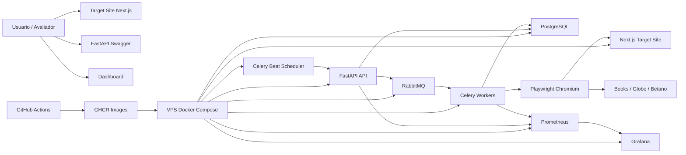
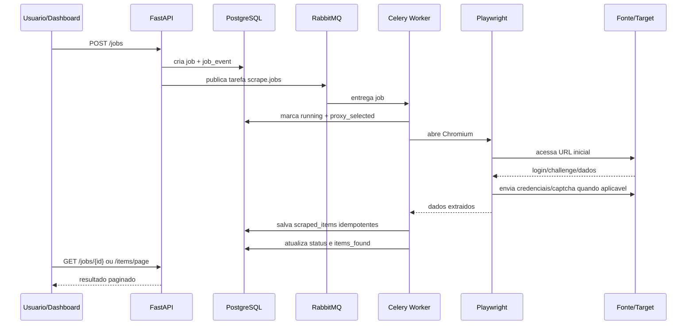
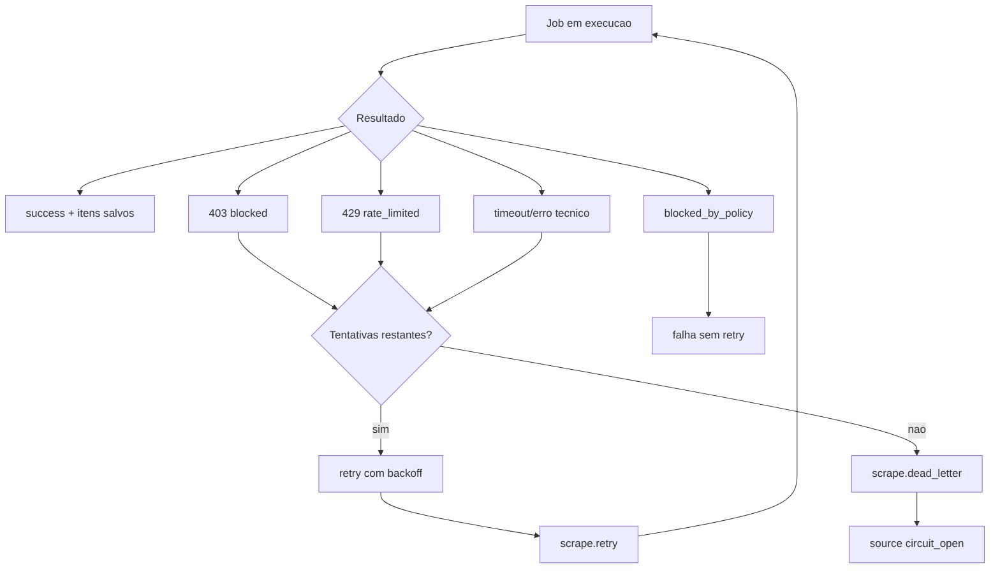
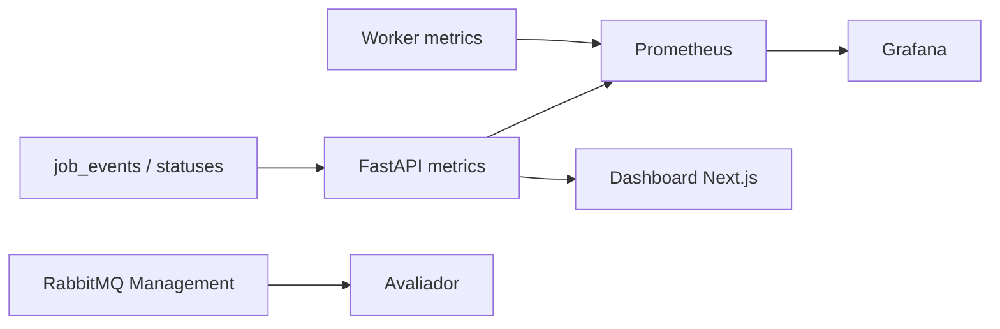

# ScaleScrape Lab - Case Back-End Pleno Procob

> Case tecnico criado por iniciativa propria para demonstrar aderencia a uma
> vaga de Desenvolvedor Back-End Pleno da Procob com foco em scraping em escala,
> mensageria, performance, observabilidade, Linux, Docker e investigacao de
> bloqueios. Este material nao representa parceria oficial com a Procob.

## Resumo Executivo

O ScaleScrape Lab e um laboratorio completo de scraping distribuido, construido
especificamente para demonstrar fit tecnico com a vaga de Desenvolvedor
Back-End Pleno da Procob. Ele mostra como eu desenho, implemento e opero um
pipeline de coleta com API, fila, workers, browser automation, persistencia,
retry, DLQ, circuit breaker, observabilidade e deploy automatizado.

Para RH, a leitura rapida e: o projeto foi feito para provar conhecimento
pratico nos pontos centrais da vaga. Para engenharia, o repositorio permite
inspecionar codigo, arquitetura, testes, Docker, CI/CD, metricas e o fluxo de
dados de ponta a ponta. O objetivo foi transformar os requisitos da vaga em uma
demo navegavel e auditavel.

## Imagem Da Aplicacao


O dashboard centraliza criacao de jobs, metricas operacionais, abas por fonte,
historico recente e links para Swagger, Grafana e RabbitMQ. A tela foi pensada
para que RH consiga entender o valor rapidamente e para que a avaliacao tecnica
consiga abrir os detalhes de arquitetura, dados persistidos e falhas.

## Links De Demonstracao

| Ambiente | UI | Dashboard | API Docs | Grafana | RabbitMQ |
| --- | --- | --- | --- | --- | --- |
| Dev | https://dev.scalescrape.cledson.com.br | https://dev.scalescrape.cledson.com.br/dashboard | https://api-dev.scalescrape.cledson.com.br/docs | https://grafana-dev.scalescrape.cledson.com.br | https://rabbit-dev.scalescrape.cledson.com.br |
| Producao | https://scalescrape.cledson.com.br | https://scalescrape.cledson.com.br/dashboard | https://api.scalescrape.cledson.com.br/docs | https://grafana.scalescrape.cledson.com.br | https://rabbit.scalescrape.cledson.com.br |

Acessos administrativos nao sao versionados no repositorio. Grafana usa
usuario `admin`; RabbitMQ Management usa `scalescrape_viewer`. As senhas ficam
nos secrets de cada ambiente.

## Como Este Case Conversa Com A Vaga

| Requisito da vaga | Evidencia no projeto |
| --- | --- |
| Scraping em larga escala | Pipeline com API, filas, workers, agendamento e benchmark controlado. |
| Pipelines distribuidos com mensageria | RabbitMQ, filas `scrape.jobs`, `scrape.retry` e `scrape.dead_letter`, com Celery workers. |
| Alto volume de requisicoes | Script `tools/load_demo.py` dispara jobs concorrentes e mede throughput, status, retries e percentis. |
| Latencia e throughput | Metricas Prometheus, Grafana, controle de timeout e backoff exponencial. |
| Workers paralelos | Worker stateless, filas separadas e execucao horizontal via Docker Compose. |
| Rate limit, CAPTCHA, anti-bot e fingerprint | Simulador anti-bot controlado, reCAPTCHA de laboratorio, browser profile, cookies, sessao e debug artifacts. |
| Proxies e controle de trafego | Proxy manager logico, cooldown por fonte/proxy e suporte a proxy proprio via Tailscale. |
| HTTP, headers, cookies e sessoes | Playwright manipula login, cookies `lab_auth`/`lab_clearance`, headers e contexto de browser. |
| Retry, timeout e falhas | Retry policy, DLQ, status por job, eventos e circuit breaker por fonte. |
| Linux, Docker e deploy | Docker Compose, GHCR, GitHub Actions, VPS, Nginx externo e migrations Alembic. |
| Monitoramento e logs | Prometheus, Grafana, RabbitMQ Management, job events e artefatos de debug. |

## Scrapers Implementados

| Fonte | O que demonstra | Dados extraidos |
| --- | --- | --- |
| `fake-target` | Site proprio protegido com login, cookies, CAPTCHA de laboratorio e simulador anti-bot. | Itens paginados, categoria, origem, detalhe e data de extracao. |
| `books-to-scrape` | Fonte publica segura para provar parsing, detalhe e normalizacao. | Titulo, preco em GBP, preco convertido para BRL, nota, descricao e link do livro. |
| `globo-home` | Coleta de noticias publicas com enriquecimento em pagina de detalhe. | Categoria, titulo, resumo, link publico, imagem original e imagem salva no storage local. |
| `betano-football` | Fonte mais dificil: site de apostas esportivas com protecoes anti-bot fortes e markup dinamico. | Campeonato, jogo, data/hora, mercado, odds 1/X/2, status de bloqueio e horario da coleta. |

### Por Que A Betano Foi Incluida

A Betano entra no case como fonte de maior dificuldade tecnica. E um site de
apostas esportivas com frontend dinamico, conteudo sensivel a localizacao,
modais, sessoes e mecanismos de protecao contra automacao. O projeto nao trata
isso como promessa de coleta garantida: ele mostra uma abordagem de engenharia
para diagnosticar e operar com responsabilidade.

O scraper possui fluxo com navegador real via Playwright, browser profile,
sessao persistida, fechamento de modais quando aparecem, tentativa por API
publica observada, fallback visual/DOM, proxy proprio via Tailscale quando o IP
da VPS sofre bloqueio, registro de `403`/redirecionamento/pagina vazia e debug
artifacts com HTML, screenshot e JSON. Quando a fonte libera o acesso no
ambiente autorizado, os mercados de futebol sao persistidos como odds
auditaveis no banco; quando bloqueia, o sistema registra o bloqueio sem entrar
em loop agressivo.

## Arquitetura Geral



## Fluxo Completo De Scraping



## Falhas, Retry, DLQ E Circuit Breaker



O objetivo nao e prometer coleta garantida em qualquer site. O objetivo e
demonstrar a engenharia por tras de um sistema que reconhece bloqueios, registra
diagnosticos, evita loops agressivos, aplica cooldown e mantem a operacao
observavel.

## Anti-Bot, CAPTCHA E Diagnostico De Bloqueios

A vaga cita contorno de bloqueios, CAPTCHA, anti-bot e fingerprint. Neste case,
esses temas aparecem de forma explicita e responsavel:

- o target-site proprio exige login, cookies de sessao e CAPTCHA de laboratorio;
- o worker detecta formulario de login, preenche credenciais e resolve o desafio
  configurado para o ambiente controlado;
- o simulador anti-bot local gera cenarios de atraso, challenge, `403`, `429` e
  mudanca de layout;
- o browser profile configura sinais de sessao, headers, idioma, viewport e
  contexto do Chromium;
- a fonte Betano, por ser um site de apostas com protecoes anti-bot mais fortes,
  possui diagnostico de bloqueio, proxy proprio/Tailscale, sessao persistida,
  fallback visual/API e artefatos de debug para entender se houve 403, redirect,
  pagina vazia ou mudanca de markup;
- qualquer uso externo deve ser autorizado, controlado e em baixo volume.

O projeto fala sobre anti-bot e bloqueios porque isso e parte do trabalho de
engenharia pedido na vaga. Ele nao documenta um passo a passo para violar
controles de terceiros.

## Persistencia E Evolucao De Banco

O banco usa PostgreSQL com SQLAlchemy e Alembic. Jobs, eventos, fontes, itens
extraidos, desafios de CAPTCHA, eventos anti-bot e perfis de proxy ficam
modelados no schema inicial.

Os itens sao persistidos de forma idempotente por `job_id`, com `created_at` e
`extracted_at`. Isso evita duplicidade por reprocessamento e deixa claro quando
cada dado foi coletado.

## Observabilidade



Durante uma demonstracao, e possivel abrir:

- dashboard para ver jobs e dados extraidos;
- Swagger para criar jobs e consultar status;
- RabbitMQ para ver filas, consumers e mensagens;
- Grafana para acompanhar metricas;
- logs/artefatos para diagnosticar falhas.

## Benchmark De Carga

O script `tools/load_demo.py` dispara N jobs concorrentes contra a API e
acompanha o status ate fim. Ele imprime:

- total enviado;
- sucessos, falhas e bloqueios;
- tempo total;
- jobs por minuto;
- itens coletados;
- duracao media, p50 e p95;
- retries/tentativas;
- resumo das filas RabbitMQ quando a Management API e informada.

Exemplo:

```bash
python tools/load_demo.py --api-url http://localhost:8000 --jobs 30 --concurrency 10 --rabbitmq-url http://localhost:15672
```

## Deploy E Operacao

O deploy usa GitHub Actions para:

- rodar testes Python e TypeScript;
- buildar API, worker e target-site;
- publicar imagens no GHCR;
- acessar a VPS por SSH;
- atualizar `.env.production`;
- rodar `alembic upgrade head`;
- subir Docker Compose;
- executar smoke de target-site, API, Grafana, RabbitMQ e scraping controlado.

Os servicos publicos ficam atras de Nginx/Certbot na VPS. Postgres, AMQP e
Prometheus permanecem internos.

## Fontes Demonstradas

| Fonte | Objetivo |
| --- | --- |
| `fake-target` | Target controlado com login, CAPTCHA, anti-bot e paginacao. |
| `books-to-scrape` | Fonte publica segura para demonstrar parsing, detalhe e conversao de preco. |
| `globo-home` | Noticias publicas por categoria, resumo, link e imagem salva localmente. |
| `betano-football` | Site de apostas esportivas para demonstrar coleta de odds, browser profile, diagnostico de bloqueio e proxy proprio. |

## Roteiro De Demonstracao Em 5 Minutos

1. Abrir `https://dev.scalescrape.cledson.com.br/dashboard`.
2. Mostrar jobs recentes e as abas de dados extraidos, principalmente Globo e Betano.
3. Clicar em uma acao de scraping manual.
4. Abrir Swagger e acompanhar `GET /jobs/{id}`.
5. Abrir RabbitMQ e mostrar filas/consumers.
6. Abrir Grafana e mostrar metricas.
7. Na aba Globo, mostrar categoria, resumo, link e imagem persistida.
8. Na aba Betano, explicar que a fonte e mais protegida, como o worker registra odds quando consegue acesso e como registra bloqueios/artefatos quando a defesa do site impede a coleta.
9. Explicar retry, DLQ, circuit breaker e idempotencia.
10. Rodar ou mostrar o benchmark controlado.

## Onde Olhar No Repositorio

- API: `apps/api/app`
- Worker: `apps/worker/app`
- Target-site/dashboard: `apps/target_site/src`
- Infra: `docker-compose.yml`, `compose.deploy.yml`, `infra/`
- CI/CD: `.github/workflows`
- Benchmark: `tools/load_demo.py`
- Fluxo tecnico detalhado: [docs/fluxo-scraping.md](fluxo-scraping.md)

## Fechamento

Este case foi construido para mostrar autonomia tecnica, perfil investigativo e
capacidade de operar uma arquitetura de scraping com volume, falhas reais,
mensageria, observabilidade e deploy. A parte visual ajuda o RH a entender o
valor rapidamente; o codigo e a infraestrutura permitem a avaliacao tecnica em
profundidade.
